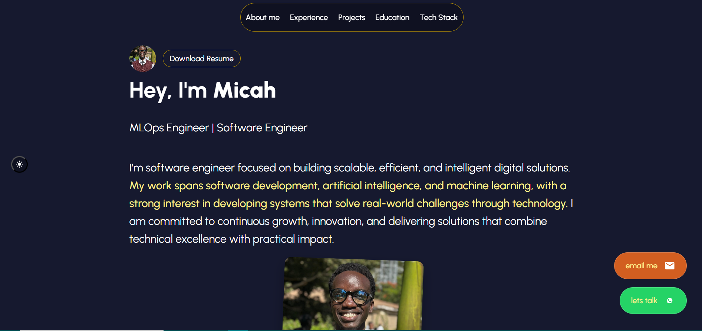

# 🎯 Micah Mosomi – Full-Stack Developer Portfolio

This is a personal developer portfolio for **Micah Mosomi**, a full-stack software engineer focused on the MERN stack, AI-driven solutions, and scalable backend architecture. The website showcases my skills, projects, education, interests, and contact details in a clean, responsive, and accessible design.

---

## 🚀 Live Preview

**[🔗 View Portfolio](https://micahnyakangomosomi.github.io/)** 

---

## 🔧 Built With

- **HTML5** – Semantically structured and SEO-optimized  
- **CSS3** – Responsive layout with custom styling
- **Accessible Markup** – Uses `aria-label`, `alt`, proper `nav` and `section` elements

---

## 📌 Features

- **Hero Section** – Clean profile intro with downloadable resume  
- **Experience Timeline** – Detailed and structured job history  
- **Projects Showcase** – Card-based layout showing project screenshots, descriptions, and tech used  
- **Education Timeline** – Academic journey with purpose-driven descriptions  
- **Interests Section** – Highlights personal focus areas (AI, systems, learning tools)  
- **Contact Form** – Simple submission-ready contact form *(non-functional yet)*  
- **SEO Tags** – Optimized for search and social sharing (Open Graph metadata included)

---

## 🛠️ Tech Stack Icons

The following technologies are visually represented using SVGs:

- **Frontend**: HTML5, CSS3, JavaScript, React, Astro, Tailwind, Radix UI, Shadcn UI, Bootstrap  
- **Backend**: Node.js, Express.js, MongoDB, MySQL, JWT  
- **Tools**: Git, GitHub, VS Code, Notion, Figma, Chart.js, TypeScript, Python

---

## 📂 Projects Included

1. **Jobsy** – AI-powered resume-based job matcher (LinkedIn scraping + bias-free job matches)  
2. **Edu** – AI-driven education platform for personalized learning  
3. **AutoFlow** – Email and calendar automation with n8n workflows

---

## 🧠 About Me

> I’m a software engineer with a deep interest in building systems that solve real-world problems.  
> My focus is on full-stack development, AI integration for decision-making and productivity, and database engineering.  
> I’m currently pursuing a BSc in Computer Science at Mount Kenya University.

---

## 📫 Contact

- **LinkedIn**: [Micah Mosomi](https://www.linkedin.com/in/micah-mosomi-a63355267/)  
- **Email**: *(Form available on portfolio site)*  
- **Resume**: [Download Resume](./public/Micah%20Mosomi%20Resume(Main).pdf)

---

## 🧪 To-Do / Future Improvements

- Add working backend for contact form (Node.js or Firebase)  
- Add light/dark mode toggle  
- Implement animation and interaction using JS or Astro integrations  
- Make project links live (Preview + GitHub Code)

---

## 📄 License

This project is for personal use only. Feel free to draw inspiration from the layout and structure but **do not copy exact content without permission**.
